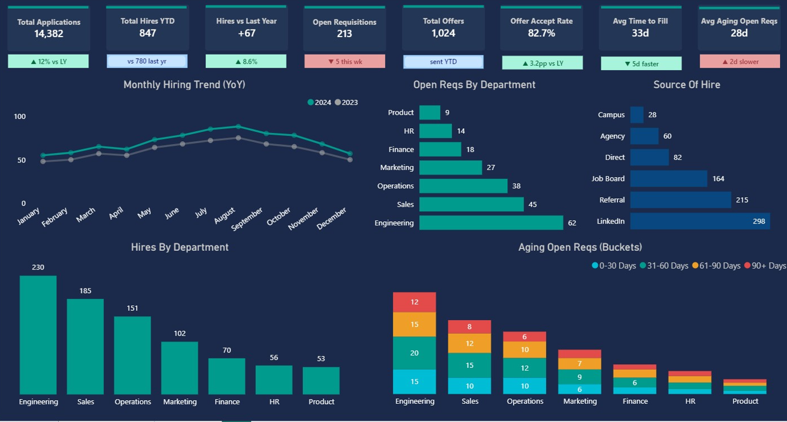
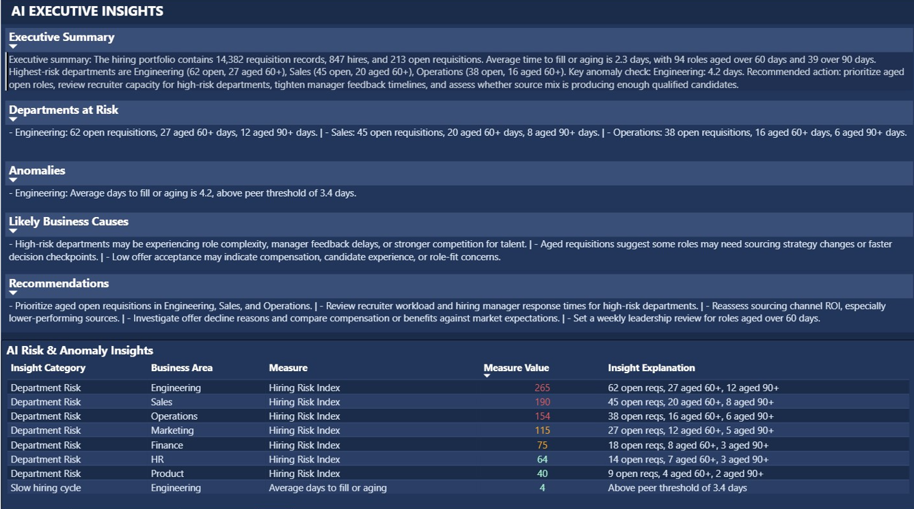

# AI Talent Acquisition Dashboard | Power BI + Python + Gemini

## Project Overview

This AI Talent Acquisition Dashboard was created using Power BI, Python, and Gemini AI to analyze global hiring performance and convert recruiting data into actionable HR insights.

The project includes two main report pages: a Hiring Overview page and an AI Executive Insights page. The Hiring Overview page tracks key recruiting metrics, while the AI Insights page summarizes hiring risks, anomalies, likely business causes, and recommended actions for leadership.

The goal of this project is to demonstrate how HR and People Analytics dashboards can move beyond reporting what happened and support faster, more confident talent acquisition decisions.

## Dashboard Preview

### Hiring Overview

### AI Executive Insights

## Key Highlights

- Total applications: 14,382
- Total hires YTD: 847
- Hires vs last year: +67
- Open requisitions: 213
- Total offers: 1,024
- Offer acceptance rate: 82.7%
- Average time to fill: 33 days
- Average aging open requisitions: 28 days
- AI-generated executive summary, department risk scoring, anomaly detection, and recommended actions

## Dashboard Insights

- Hiring performance improved year over year, with 847 hires YTD and 67 more hires compared to the previous year.
- Offer acceptance is strong at 82.7%, suggesting a healthy conversion rate from offer to hire.
- Engineering has the highest number of open requisitions and is flagged as a high-risk department.
- Engineering also shows slower hiring movement, with average days to fill or aging above the peer threshold.
- LinkedIn and referrals are the strongest hiring sources based on source-of-hire volume.
- Aging requisitions are concentrated in Engineering, Sales, and Operations, especially roles aged over 60 and 90 days.
- The AI Insights page translates hiring data into management-ready recommendations instead of requiring leaders to manually interpret every chart.

## AI Insight Layer

Python and Gemini AI were used to enhance the dashboard with decision-support outputs, including:

- Executive summaries generated from hiring data
- Department hiring risk scoring
- Anomaly detection for slower hiring cycles
- Likely business cause explanations
- Prioritized management recommendations

This AI layer helps convert operational recruiting data into clear next steps for HR leaders and hiring managers.

## Business Impact

This dashboard helps HR, People Analytics, and Talent Acquisition teams:

- Monitor recruiting pipeline health
- Identify departments with hiring bottlenecks
- Track source effectiveness and offer acceptance
- Prioritize aging requisitions that need immediate attention
- Support recruiting capacity planning and leadership reporting
- Move from descriptive reporting to AI-assisted decision support

## Recommendations

- Prioritize aged open requisitions in Engineering, Sales, and Operations.
- Review recruiter workload and hiring manager response times for high-risk departments.
- Reassess sourcing channel ROI, especially for lower-performing sources.
- Investigate offer decline reasons and compare compensation or benefits against market expectations.
- Set a weekly leadership review for roles aged over 60 days.

## Suggested Actions

- Create a weekly recruiting risk review using the AI Insights page.
- Use department risk scores to prioritize recruiter and hiring manager follow-up.
- Monitor open requisitions by aging bucket to reduce long-running vacancies.
- Compare source-of-hire performance to optimize sourcing investment.
- Track offer acceptance and time-to-fill trends monthly to measure recruiting effectiveness.

## Tools Used

- Power BI Desktop
- Power Query
- DAX
- Python
- Gemini AI
- Excel
- Data Visualization
- People Analytics
- Talent Acquisition Analytics
- Business Intelligence

## Files Included

- `Global_Talent_Acquisition_Hiring_Overview.png` - Hiring overview dashboard preview
- `Global_Talent_Acquisition_AI_Insight.png` - AI executive insights dashboard preview

## Note

The Power BI `.pbix`, Python scripts, and source dataset are not included in this repository to avoid exposing private data, API keys, or sensitive project configuration.

## About This Project

This project was created as part of my data analytics portfolio to demonstrate skills in Power BI dashboard design, People Analytics, Talent Acquisition analytics, Python-assisted analysis, generative AI insight generation, KPI reporting, and business intelligence storytelling.

